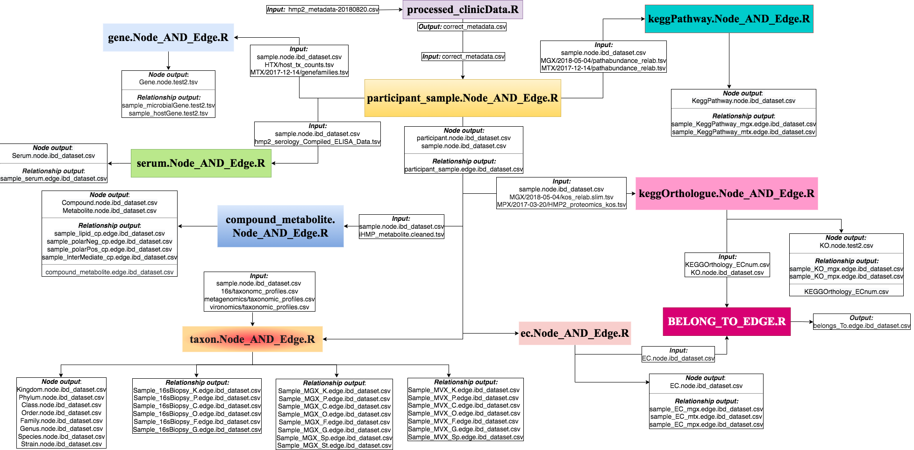

# Multi-Omics Graph Database Model  

Multi-Omics integrated graph database. Our graph database provides a useful analytical platform to help a better understanding of integrated data. The current version of model is specifically used the multi-omcis datasets from 'The Inflammatory Bowel Disease Multi'omics Database (IBDMDB)' (Lloyd-Price et al. 2019). Neo4j is a graph database management system that uses a graph database model. Our multi-omics graph database is highly queryalbe and provides several case studies that utilize simple as well as complex queries for studying IBD. Each step for populating our graph DB will be deatiled below. 

Contact the author at suyeonkim [at] unomaha.edu. This version has been tested for OSX. 
## Steps for populating the multi-omics graph database


### Pre-requisites
Please make sure you have Conda installed. 
neo4r is an R package that can be run as an R function. 

#### Installation N4o4j and running a local database 
To populate our graph database model, it needs to able to access a Neo4j database. Here, the instracutions below are to run the Neo4j via a server on macOS compouters. 

From command line 
  1. Open up your terminal and create a 'demo' folder.
  ```
  mkdir demo
  ```
  2. Download the macOS version of Neo4j listed under community server and unzip the Neo4j downalod in a folder of your choice. 
  ```
  wget https://neo4j.com/artifact.php?name=neo4j-community-4.3.13-unix.tar.gz
  tar -xf neo4j-community-4.3.13-unix.tar.gz
  ```
  3. Make sure JAVA version *** 

### Download IBDMDB Data 
1. Download the datasets from [The Inflammatory Bowel Disease Multi'omics Database](https://ibdmdb.org/) website. 
2. Use FTP transfer tool for batch downloading.
3. Copy `ftp.broadinstitute.org` address and paste it in new tab, with adding 'ftp` instead 'http'.
4. Once open the folder, use given `username/password` to access the datasets. 


Download the macOS version of Neo4j listed under Community server
Unzip the Neo4j download in a folder of your choice
In command line, navigate to the Neo4j folder where you unzipped the download
Run ./bin/neo4j console to start the server
Run CTRL+C to stop the server

### Data pre-processing input files 

1. Processing metadata file
* `Input file`: hmp2_metadata-20180820.csv for first script, Output of `processed_metaData.R`(first script) `correct_metadata.csv` is an input for second script.
* `Output node files`: participant.node.ibd_dataset.csv, sample.node.ibd_dataset.csv<br/>
* `Output relationship files`: participant_sample.edge.ibd_dataset.csv
```
Rscript src/processed_metaData.R src/ Input/hmp2_metadata-20180820.csv
Rscript src/participant_sample.Node_AND_Edge.R src/ input/correct_metadata.csv ibd_dataset
```

2. Processing Taxonomic profile
* `Input file`: *16s Biopsy*: taxonomic_profiles.tsv , *Metagenome*: taxonomic_profiles.tsv , and *Virome*: taxonomic_profiles.tsv
* `Output node files`: Kingdom/Phylum/Class/Order/Family/Genus/Species/Strain.node.ibd_dataset.csv<br/> 
* `Output relationship files`: sample_16sBiopsy_K/P/C/O/F/G.edge.ibd_dataset.csv, sample_MGX_K/P/C/O/F/G/Sp/St.edge.ibd_dataset.csv, sample_MVX_K/P/C/O/F/G/Sp.edge.ibd_dataset.csv
```
Rscript src/taxon.Node_AND_Edge.R src/ ihmp/ftp.broadinstitute.org/products/HMP2/16S/2018-01-07/taxonomic_profiles.tsv ihmp/ftp.broadinstitute.org/products/HMP2/MGX/2018-05-04/taxonomic_prof_processing/taxonomic_profiles.tsv mihmp/ftp.broadinstitute.org/products/HMP2/MVX/taxonomic_profiles.tsv sample.node.test4.csv test4
```
**_TEST_in CRANE**
```
Rscript src/taxon.Node_AND_Edge.R src/ ../../ihmp/ftp.broadinstitute.org/products/HMP2/16S/2018-01-07/taxonomic_profiles.tsv ../../ihmp/ftp.broadinstitute.org/products/HMP2/MGX/2018-05-04/taxonomic_prof_processing/taxonomic_profiles.tsv ../../ihmp/ftp.broadinstitute.org/products/HMP2/MVX/taxonomic_profiles.tsv sample.node.ibd_dataset.csv ibd_dataset
```

3 Processing KEGG Orthologue profile
* `Input file`: **Metagenome**: kos_realb.slim.tsv and **Metaproteome**: HMP2_proteomics_kos.tsv
* `Output node files`: KO.node.ibd_dataset.csv<br/> 
* `Output relationship files`: sample_KO_mgx.edge.ibd_dataset.csv, sample_KO_mpx.edge.ibd_dataset.csv, 
* `Output file`: KEGGOrthology_ECnum.csv
```
Rscript src/keggOrthologue.Node_AND_Edge.R src/ ihmp/ftp.broadinstitute.org/products/HMP2/MGX/2018-05-04/kos_relab.slim.tsv ihmp/ftp.broadinstitute.org/products/HMP2/MPX/2017-03-20/HMP2_proteomics_kos.tsv sample.node.ibd_dataset.csv ibd_dataset
```

4. Processing KEGG Pathway profile
* `Input file`: **Metagenome**: pathabundance_relab.tsv and **Metatranscriptome**: pathabundance_relab.tsv
* `Output node file`: KeggPathway.node.ibd_dataset.csv<br/>
* `Output relationship files`: sample_KeggPathway_mgx.edge.ibd_dataset.csv, sample_KeggPathway_mtx.edge.ibd_dataset.csv
```
Rscript src/keggPathway.Node_AND_Edge.R src/ ihmp/ftp.broadinstitute.org/products/HMP2/MGX/2018-05-04/pathabundance_relab.tsv ihmp/ftp.broadinstitute.org/products/HMP2/MTX/2017-12-14/pathabundance_relab.tsv sample.node.ibd_dataset.csv ibd_dataset
```

5. Processing EC profile 
* `Input file`: **Metagenome**: ecs_relab.slim.tsv, **Metatranscriptome**: ecs_relab.tsv, and **Metaproteome**: HMP2_proteomics_ecs.tsv
* `Output node file`: EC.node.ibd_dataset.csv<br/> 
* `Output relationship files`: sample_EC_mgx.edge.ibd_dataset.csv, sample_EC_mtx.edge.ibd_dataset.csv, sample_EC_mpx.edge.ibd_dataset.csv
```
Rscript src/ec.Node_AND_Edge.R src/ ihmp/ftp.broadinstitute.org/products/HMP2/MGX/2018-05-04/ecs_relab.slim.tsv ihmp/ftp.broadinstitute.org/products/HMP2/MTX/2017-12-14/ecs_relab.tsv ihmp/ftp.broadinstitute.org/products/HMP2/MPX/2017-03-20/HMP2_proteomics_ecs.tsv sample.node.ibd_dataset.csv ibd_dataset
```

6. Processing Metabolite profile [REVISIT]
* `Input file`: iHMP_metabolite.cleaned.tsv
* `Output node files`: Compound.node.test4.csv, Metabolite.node.test4.csv<br/>
* `Output relationship files`: sample_polarNeg_cp.edge.test4.csv, sample_polarPos_cp.edge.test4.csv, sample_InterMediate_cp.edge.test4.csv, sample_lipid_cp.edge.test4.csv, compound_metabolite.edge.test4.csv
```
Rscript src/compound_metabolite.Node_AND_Edge.R src/ ihmp/ftp.broadinstitute.org/products/HMP2/MBX/iHMP_metabolite.cleaned.tsv sample.node.test4.csv test4  
```

7. Processing Serum marker profile 
* `Input file`: hmp2_serology_Compiled_ELISA_Data.tsv<br/>
* `Output node file`: Serum.node.ibd_dataset.csv<br/>
* `Output relationship file`: sample_serum.edge.ibd_dataset.csv
```
Rscript src/serum.Node_AND_Edge.R src/ ihmp/ftp.broadinstitute.org/products/HMP2/Serology/2017-10-05/hmp2_serology_Compiled_ELISA_Data.tsv sample.node.ibd_dataset.csv ibd_dataset
```

8. Processing Gene profile 
* `Input files`: **_Host transcriptome_**: host_tx_counts.tsv, **_Metatranscriptome_**: genefamilies.tsv
* `Output node file`: Gene.node.ibd_dataset.csv<br/>
* `Output relationship files`: sample_microbialGene.edge.ibd_dataset.csv, sample_hostGene.edge.ibd_dataset.csv
```
Rscript src/gene.Node_AND_Edge.R src/ ihmp/ftp.broadinstitute.org/products/HMP2/HTX/host_tx_counts.tsv ihmp/ftp.broadinstitute.org/products/HMP2/MTX/2017-12-14/genefamilies.tsv sample.node.ibd_dataset.csv ibd_dataset
```

9. Processing BELONG_TO edge file 
* `Input files`: KO.node.ibd_dataset.csv, EC.node.ibd_dataset.csv, KEGGOrthology_ECnum.csv<br/>
* `Output file`: belongs_To.edge.ibd_dataset.csv
```
Rscript src/belongs_To.Edge.R src/ KO.node.ibd_dataset.csv EC.node.ibd_dataset.csv KEGGOrthology_ECnum.csv ibd_dataset
```

### Populating a database model in Neo4j
1. Move previoulsy generated output files to the Neo4j `import` folder. 
2. Create a ibd database under `data/database` folder. Then, change the name of database in the neo4j configuration file under the `conf` folder.
*Note*: [Naming rules and recommendations](https://neo4j.com/docs/cypher-manual/current/syntax/naming/)
```
mkdir data/databases/ibd
```
3. Then, change the name of the default database in the neo4j configuration file under the `conf` folder. 
```
dbms.default_database=ibd
```
4. Now, we are ready to import data files using `neo4j-import` tool. <br/>
*Note*: [Neo4j-admin-import](https://neo4j.com/docs/operations-manual/current/tutorial/neo4j-admin-import/)
```
./bin/neo4j-admin import --database=ibd --nodes=participant.node.test4.csv --nodes=sample.node.test4.csv --nodes=Gene.node.test4.csv --nodes=KeggPathway.node.test4.csv --nodes=KO.node.test4.csv --nodes=Compound.node.test4.csv --nodes=Metabolite.node.test4.csv --nodes=EC.node.test4.csv --nodes=Serum.node.test4.csv --nodes=Kingdom.node.test4.csv --nodes=Phylum.node.test4.csv --nodes=Class.node.test4.csv --nodes=Order.node.test4.csv --nodes=Family.node.test4.csv --nodes=Genus.node.test4.csv --nodes=Species.node.test4.csv --nodes=Strain.node.test4.csv --relationships=participant_sample.edge.test4.csv --relationships=sample_hostGene.edge.test4.csv --relationships=sample_microbialGene.edge.test4.csv --relationships=sample_KeggPathway_mgx.edge.test4.csv --relationships=sample_KeggPathway_mtx.edge.test4.csv --relationships=sample_KO_mgx.edge.test4.csv --relationships=sample_KO_mpx.edge.test4.csv --relationships=sample_EC_mgx.edge.test4.csv --relationships=sample_EC_mtx.edge.test4.csv --relationships=sample_EC_mpx.edge.test4.csv --relationships=sample_serum.edge.test4.csv --relationships=sample_16sBiopsy_K.edge.test4.csv --relationships=sample_16sBiopsy_P.edge.test4.csv --relationships=sample_16sBiopsy_C.edge.test4.csv --relationships=sample_16sBiopsy_O.edge.test4.csv --relationships=sample_16sBiopsy_F.edge.test4.csv --relationships=sample_16sBiopsy_G.edge.test4.csv --relationships=sample_MGX_K.edge.test4.csv --relationships=sample_MGX_P.edge.test4.csv --relationships=sample_MGX_C.edge.test4.csv --relationships=sample_MGX_O.edge.test4.csv --relationships=sample_MGX_F.edge.test4.csv --relationships=sample_MGX_G.edge.test4.csv --relationships=sample_MGX_Sp.edge.test4.csv --relationships=sample_MGX_St.edge.test4.csv --relationships=sample_MVX_K.edge.test4.csv --relationships=sample_MVX_P.edge.test4.csv --relationships=sample_MVX_C.edge.test4.csv --relationships=sample_MVX_O.edge.test4.csv --relationships=sample_MVX_F.edge.test4.csv --relationships=sample_MVX_G.edge.test4.csv --relationships=sample_MVX_Sp.edge.test4.csv --relationships=sample_polarNeg_cp.edge.test4.csv --relationships=sample_polarPos_cp.edge.test4.csv --relationships=sample_InterMediate_cp.edge.test4.csv --relationships=sample_lipid_cp.edge.test4.csv --relationships=compound_metabolite.edge.test4.csv --relationships=belongs_To.edge.test4.csv
```
### Run Neo4j console to start the server 
```
./bin/neo4j start    
```
#### *If your current location is already in the bin folder*
```
./neo4j start
```

